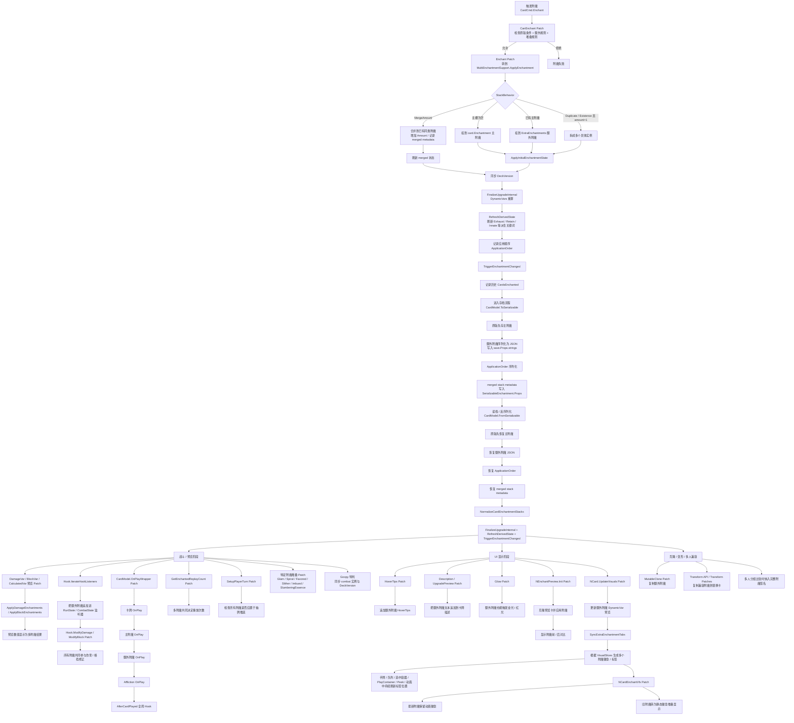

# MultiEnchantmentMod 附魔生命周期文档

## 1. 文档目标

本文档描述 `MultiEnchantmentMod` 中一张卡牌从**应用附魔**到**存档/读档**、再到**战斗生效**与**UI 显示**的完整生命周期。

项目入口位于 `MultiEnchantmentMod.cs:21`，核心实现主要分布在：

- `MultiEnchantmentSupport.cs`
- `MultiEnchantmentPatches.cs`
- `MultiEnchantmentStackSupport.cs`
- `MultiEnchantmentStackPatches.cs`
- `MultiEnchantmentTransformApi.cs`
- `MultiEnchantmentTransformPatches.cs`

---

## 2. 核心状态模型

这个 Mod 并不是简单地把多个附魔直接塞进原版 `card.Enchantment`，而是扩展出一套新的状态模型：

- `card.Enchantment`：原版主附魔 `MultiEnchantmentSupport.cs:94`
- `CardStates[card].ExtraEnchantments`：额外附魔列表 `MultiEnchantmentSupport.cs:45` `MultiEnchantmentSupport.cs:113`
- `CardStates[card].ApplicationOrder`：附魔应用顺序，用于战斗计算顺序与 UI 展示顺序 `MultiEnchantmentSupport.cs:2063` `MultiEnchantmentSupport.cs:1207`
- merged stack metadata：合并型附魔的切片数据，保存在 `EnchantmentModel.Props` 中 `MultiEnchantmentStackSupport.cs:15` `MultiEnchantmentStackSupport.cs:258`

统一读取入口是：

- `MultiEnchantmentSupport.GetEnchantments(card)`：返回“主附魔 + 额外附魔”整体视图 `MultiEnchantmentSupport.cs:87`

---

## 3. 完整流程图



---

## 4. 阶段一：附魔应用

### 4.1 入口

附魔的入口是对原版流程的 Harmony Patch：

- `EnchantmentModel.CanEnchant` 前置补丁：`MultiEnchantmentPatches.cs:47`
- `CardCmd.Enchant` 前置补丁：`MultiEnchantmentPatches.cs:84`

流程如下：

1. `CanEnchantPrefix` 先保留原版基础限制：状态牌、诅咒牌、任务牌不可附魔等 `MultiEnchantmentPatches.cs:54`
2. 调用 `MultiEnchantmentStackSupport.PassesAdditionalCanEnchantRules()` 做额外校验，例如 `Goopy`、`Nimble`、`Instinct`、`Slither` 等特殊规则 `MultiEnchantmentPatches.cs:74` `MultiEnchantmentStackSupport.cs:126`
3. 调用 `MultiEnchantmentStackSupport.CanApply(card, enchantmentType)` 判断当前堆叠规则是否允许继续附魔 `MultiEnchantmentPatches.cs:80` `MultiEnchantmentStackSupport.cs:120`
4. 真正附魔时，`CardCmd.Enchant` 被重定向到 `MultiEnchantmentSupport.ApplyEnchantment()` `MultiEnchantmentPatches.cs:88` `MultiEnchantmentSupport.cs:270`

### 4.2 应用策略

`ApplyEnchantment()` 会先读取附魔的堆叠行为：

- `DisallowDuplicate`
- `MergeAmount`
- `DuplicateInstance`
- `ExistenceStack`

定义位于 `MultiEnchantmentStackApi.cs:11`，内置规则位于 `MultiEnchantmentStackSupport.cs:433`。

实际处理逻辑：

#### A. MergeAmount
如果该类型允许“合并数量”，并且卡上已经存在同类型附魔：

- 直接给已有附魔增加 `Amount` `MultiEnchantmentSupport.cs:283`
- 记录 merged stack 切片信息 `MultiEnchantmentSupport.cs:288` `MultiEnchantmentStackSupport.cs:223`
- 执行增量状态刷新与重算 `MultiEnchantmentSupport.cs:289` `MultiEnchantmentSupport.cs:290`

#### B. 主附魔槽为空
如果 `card.Enchantment == null`：

- 直接走原版主附魔槽 `card.EnchantInternal(...)` `MultiEnchantmentSupport.cs:1711` `MultiEnchantmentSupport.cs:1715`

#### C. 已有主附魔
如果主附魔已存在：

- 把新附魔挂到 `ExtraEnchantments` `MultiEnchantmentSupport.cs:417` `MultiEnchantmentSupport.cs:430`

#### D. DuplicateInstance / ExistenceStack 且 amount > 1
如果一次应用的数量大于 1，且行为要求拆成多个实例：

- 不保留成单个 `Amount > 1`
- 而是拆成多个具体附魔实例逐个挂载 `MultiEnchantmentSupport.cs:342` `MultiEnchantmentSupport.cs:352` `MultiEnchantmentSupport.cs:383`

### 4.3 初始状态应用

附魔挂到卡上后，会执行 `ApplyInitialEnchantmentState()` `MultiEnchantmentSupport.cs:1676`：

- `MergeAmount`：重建 merged metadata，并按总量刷新状态 `MultiEnchantmentSupport.cs:1679`
- `ExistenceStack`：除第一个实例外，后续实例不再重复执行一次性 `OnEnchant()` 副作用 `MultiEnchantmentSupport.cs:1690`
- 其他类型：正常调用 `ModifyCard()` `MultiEnchantmentSupport.cs:1699`

### 4.4 收尾动作

附魔应用结束后，还会做这些同步：

- 同步到 `DeckVersion` `MultiEnchantmentSupport.cs:291` `MultiEnchantmentSupport.cs:1638`
- `FinalizeUpgradeInternal()` 重算卡牌状态 `MultiEnchantmentSupport.cs:293`
- `RefreshDerivedState()` 更新派生关键词，如 `Exhaust`、`Retain`、`Innate`、`Eternal` `MultiEnchantmentSupport.cs:296` `MultiEnchantmentStackSupport.cs:336`
- 更新应用顺序 `ApplicationOrder` `MultiEnchantmentSupport.cs:295`
- 触发 `EnchantmentChanged` 事件 `MultiEnchantmentSupport.cs:297` `MultiEnchantmentSupport.cs:1543`
- 写入历史记录 `CardsEnchanted` `MultiEnchantmentSupport.cs:298` `MultiEnchantmentSupport.cs:1530`

---

## 5. 阶段二：存档与读档

### 5.1 存档

原版只会保存主附魔，因此 Mod 在 `CardModel.ToSerializable` 的 postfix 中补充额外数据：

- Patch 入口：`MultiEnchantmentPatches.cs:134`
- 实现：`MultiEnchantmentSupport.SerializeAdditionalEnchantments()` `MultiEnchantmentSupport.cs:564`

保存内容包括：

#### A. 额外附魔列表
- 额外附魔会被逐个转换为 `SerializableEnchantment` `MultiEnchantmentSupport.cs:568`
- 再整体序列化成 JSON 字符串 `MultiEnchantmentSupport.cs:581`
- 写入 `save.Props.strings` 的 `MultiEnchantmentData` 字段 `MultiEnchantmentSupport.cs:582`

#### B. ApplicationOrder
- 附魔应用顺序单独存为 `MultiEnchantmentOrderData` `MultiEnchantmentSupport.cs:656`

#### C. merged stack metadata
- 每个附魔自己的 `Props` 中还会写入 `MultiEnchantmentMergedStackAmounts` `MultiEnchantmentStackSupport.cs:258` `MultiEnchantmentStackSupport.cs:275`

### 5.2 读档

读档入口：

- Patch 入口：`MultiEnchantmentPatches.cs:141`
- 实现：`MultiEnchantmentSupport.DeserializeAdditionalEnchantments()` `MultiEnchantmentSupport.cs:596`

恢复流程：

1. 原版先恢复主附魔
2. Mod 从 `MultiEnchantmentData` 读取 JSON `MultiEnchantmentSupport.cs:601`
3. 逐个 `EnchantmentModel.FromSerializable(...)` 恢复额外附魔实例 `MultiEnchantmentSupport.cs:627` `MultiEnchantmentSupport.cs:631`
4. 通过 `RestoreAdditionalEnchantmentState()` 挂回卡牌 `MultiEnchantmentSupport.cs:632`
5. 恢复 `ApplicationOrder` `MultiEnchantmentSupport.cs:644` `MultiEnchantmentSupport.cs:680`
6. 对整张卡执行 `NormalizeCardEnchantmentStacks()` 做兼容清洗 `MultiEnchantmentSupport.cs:645` `MultiEnchantmentSupport.cs:210`
7. 重新触发：
   - `TriggerEnchantmentChanged()` `MultiEnchantmentSupport.cs:646`
   - `FinalizeUpgradeInternal()` `MultiEnchantmentSupport.cs:647`
   - `RefreshDerivedState()` `MultiEnchantmentSupport.cs:648`

### 5.3 容错策略

如果某个额外附魔反序列化失败：

- 不会让整张卡或整局存档崩掉
- 只记录日志并跳过该附魔 `MultiEnchantmentSupport.cs:635` `MultiEnchantmentSupport.cs:637`

---

## 6. 阶段三：战斗生效

战斗层分成四部分：

1. 数值预览
2. 全局 Hook 监听
3. 出牌执行时序
4. 特定附魔的堆叠修补

### 6.1 数值预览

这些 Patch 会让伤害/格挡预览先应用多附魔：

- `DamageVar.UpdateCardPreview` `MultiEnchantmentPatches.cs:407`
- `BlockVar.UpdateCardPreview` `MultiEnchantmentPatches.cs:426`
- `CalculatedDamageVar.UpdateCardPreview` `MultiEnchantmentPatches.cs:445`
- `CalculatedBlockVar.UpdateCardPreview` `MultiEnchantmentPatches.cs:494`
- `ExtraDamageVar.UpdateCardPreview` `MultiEnchantmentPatches.cs:532`
- `OstyDamageVar.UpdateCardPreview` `MultiEnchantmentPatches.cs:551`

核心调用：

- `ApplyDamageEnchantments(card, damage, props, hookType)` `MultiEnchantmentSupport.cs:179`
- `ApplyBlockEnchantments(card, block, props)` `MultiEnchantmentSupport.cs:198`

这两个方法会遍历 `GetOrderedEnchantmentEntries(card)`，依照附魔应用顺序，把所有附魔依次纳入伤害/格挡运算 `MultiEnchantmentSupport.cs:182` `MultiEnchantmentSupport.cs:201` `MultiEnchantmentSupport.cs:1252`。

### 6.2 全局 Hook 监听器扩展

原版很多战斗逻辑依赖 `RunState.IterateHookListeners()` 和 `CombatState.IterateHookListeners()`。

Mod 在这里把额外附魔也追加进去：

- `RunState.IterateHookListeners` patch：`MultiEnchantmentPatches.cs:393`
- `CombatState.IterateHookListeners` patch：`MultiEnchantmentPatches.cs:400`
- 实现：`MultiEnchantmentSupport.AppendRunStateExtraEnchantments()` `MultiEnchantmentSupport.cs:912`
- 实现：`MultiEnchantmentSupport.AppendCombatStateExtraEnchantments()` `MultiEnchantmentSupport.cs:931`

这一步的意义是：

**额外附魔会像主附魔一样参与全局战斗 Hook。**

### 6.3 Hook.ModifyDamage / Hook.ModifyBlock

原版只会对主附魔做处理，Mod 改成对所有附魔生效：

- `Hook.ModifyBlock` patch：`MultiEnchantmentPatches.cs:214`
- `Hook.ModifyDamage` patch：`MultiEnchantmentPatches.cs:257`

做法是：

1. 先通过 `ApplyDamageEnchantments` / `ApplyBlockEnchantments` 注入全部附魔的卡面修正 `MultiEnchantmentPatches.cs:230` `MultiEnchantmentPatches.cs:275`
2. 再保持原版 listener 顺序，继续跑全局加算/乘算/上限修正 `MultiEnchantmentPatches.cs:232` `MultiEnchantmentPatches.cs:242` `MultiEnchantmentPatches.cs:857`

### 6.4 出牌时序

`CardModel.OnPlayWrapper` 被整体接管：

- Patch：`MultiEnchantmentPatches.cs:347`
- 实现：`MultiEnchantmentSupport.OnPlayWrapperWithMultiEnchantments()` `MultiEnchantmentSupport.cs:964`

关键时序如下：

1. 卡牌自身 `OnPlay` `MultiEnchantmentSupport.cs:1040`
2. 主附魔 `OnPlay` `MultiEnchantmentSupport.cs:1042`
3. 所有额外附魔 `OnPlay` `MultiEnchantmentSupport.cs:1048`
4. Affliction `OnPlay` `MultiEnchantmentSupport.cs:1050`
5. `Hook.AfterCardPlayed` `MultiEnchantmentSupport.cs:1060`

额外附魔统一通过 `RunAdditionalEnchantmentsOnPlay()` 执行 `MultiEnchantmentSupport.cs:950`。

### 6.5 重放次数与回合开始逻辑

#### 重放次数
- `CardModel.GetEnchantedReplayCount` 被重定向到 `MultiEnchantmentSupport.GetReplayCount()` `MultiEnchantmentPatches.cs:126` `MultiEnchantmentSupport.cs:160`
- 所有附魔都会依顺序修改重放次数 `MultiEnchantmentSupport.cs:163`

#### 回合开始置底抽牌堆
- `CombatManager.SetupPlayerTurn` 被完整接管 `MultiEnchantmentPatches.cs:202`
- 第 1 回合时会检查所有附魔是否要求卡牌置底 `MultiEnchantmentPatches.cs:991` `MultiEnchantmentSupport.cs:150`

### 6.6 特定堆叠附魔修补

`MultiEnchantmentStackPatches.cs` 单独修正了一些原版附魔在叠层时的真实语义：

- `Glam.EnchantPlayCount`：按 `Amount` 增加重放次数 `MultiEnchantmentStackPatches.cs:19`
- `Spiral.EnchantPlayCount`：按 `Amount` 增加重放次数 `MultiEnchantmentStackPatches.cs:29`
- `Favored.EnchantDamageMultiplicative`：倍率变为 `2^Amount` `MultiEnchantmentStackPatches.cs:37`
- `Slither.AfterCardDrawn`：按 hook execution count 多次随机费用 `MultiEnchantmentStackPatches.cs:47`
- `Imbued.AfterPlayerTurnStart`：按层数自动多次出牌 `MultiEnchantmentStackPatches.cs:55`
- `SlumberingEssence.BeforeFlush`：按层数多次降费 `MultiEnchantmentStackPatches.cs:63`

这些次数都通过 `MultiEnchantmentStackApi.GetHookExecutionCount(...)` 统一计算 `MultiEnchantmentStackPatches.cs:82` `MultiEnchantmentStackApi.cs:290`。

### 6.7 Goopy 特殊处理

`Goopy` 不是简单叠层，而是**每个实例有自己的运行时 Amount 成长**，因此不能像 merged stack 一样粗暴合并。

- Patch：`MultiEnchantmentPatches.cs:371`
- 实现：`MultiEnchantmentSupport.HandleGoopyAfterCardPlayed()` `MultiEnchantmentSupport.cs:1733`

效果：

- 当前战斗中的对应 `Goopy` 实例会增长 `Amount` `MultiEnchantmentSupport.cs:1740`
- 同时把相同索引的 `Goopy` 实例同步到 `DeckVersion`，保证战斗后状态持久化 `MultiEnchantmentSupport.cs:1747` `MultiEnchantmentSupport.cs:1763`

---

## 7. 阶段四：UI 显示

UI 层的目标是把“多附魔状态”还原成玩家能看懂的内容：

- 文本
- HoverTip
- 卡面标签
- 动画特效
- 预览卡

### 7.1 描述文本与 HoverTip

相关 Patch：

- `CardModel.get_HoverTips` `MultiEnchantmentPatches.cs:167`
- `CardModel.GetDescriptionForPile` `MultiEnchantmentPatches.cs:174`
- `CardModel.GetDescriptionForUpgradePreview` `MultiEnchantmentPatches.cs:181`
- `CardModel.get_ShouldGlowGold` `MultiEnchantmentPatches.cs:188`
- `CardModel.get_ShouldGlowRed` `MultiEnchantmentPatches.cs:195`

实现：

- `AppendAdditionalHoverTips()`：把额外附魔 HoverTip 拼接到原结果后面 `MultiEnchantmentSupport.cs:747`
- `AppendAdditionalExtraCardText()`：把额外附魔文本追加到卡牌描述中 `MultiEnchantmentSupport.cs:709`
- `ShouldGlowGold()` / `ShouldGlowRed()`：额外附魔也能控制卡牌发光 `MultiEnchantmentSupport.cs:140` `MultiEnchantmentSupport.cs:145`

### 7.2 预览卡

`NEnchantPreview.Init` 被重写：

- Patch：`MultiEnchantmentPatches.cs:571`

预览流程：

1. 左侧显示原卡 `MultiEnchantmentPatches.cs:583`
2. 克隆一张预览卡 `MultiEnchantmentPatches.cs:587`
3. 在预览卡上调用 `ApplyEnchantment()`，让预览也走完整的多附魔逻辑 `MultiEnchantmentPatches.cs:588`
4. 右侧显示附魔后的结果 `MultiEnchantmentPatches.cs:591`

### 7.3 卡面附魔标签

核心入口：

- `NCard.UpdateVisuals` prefix：`MultiEnchantmentPatches.cs:597`
- `NCard.UpdateEnchantmentVisuals` postfix：`MultiEnchantmentPatches.cs:604`

实现：

- `UpdateAdditionalEnchantmentPreviews()`：先为额外附魔刷新 DynamicVar 预览 `MultiEnchantmentSupport.cs:752`
- `SyncExtraEnchantmentTabs()`：根据当前卡的视觉状态，生成并同步多个附魔标签 `MultiEnchantmentSupport.cs:775`

标签显示使用的是 `VisualSlices`，不是简单按 live instance 数量展示：

- `MultiEnchantmentStackSupport.GetSnapshot()` 会同时构建 `GameplaySlices` 和 `VisualSlices` `MultiEnchantmentStackSupport.cs:59`
- `MultiEnchantmentSupport.GetDefaultOrderedVisualEntries()` 再把这些切片转成实际 UI 标签 `MultiEnchantmentSupport.cs:1284`

所以：

- gameplay 上可能是 merged stack
- UI 上可以拆成多个 badge 逐层展示

### 7.4 动态容器同步

很多 UI 容器会复用同一张 `NCard`，所以仅在 `UpdateVisuals` 中刷新还不够。项目专门对这些路径补了同步：

- 手牌 holder 缩放/移动：`MultiEnchantmentPatches.cs:633` `MultiEnchantmentPatches.cs:646`
- 出牌队列 tween / model swap：`MultiEnchantmentPatches.cs:656` `MultiEnchantmentPatches.cs:669`
- 进入 play container：`MultiEnchantmentPatches.cs:682`
- peek 切换：`MultiEnchantmentPatches.cs:692`
- 卡牌回到手牌：`MultiEnchantmentPatches.cs:705`
- 多选容器：`MultiEnchantmentPatches.cs:718`
- 飞向出牌区动画：`MultiEnchantmentPatches.cs:731`
- 节点解绑 / 回池：`MultiEnchantmentPatches.cs:621` `MultiEnchantmentPatches.cs:741`

这些补丁最终都围绕两个方法：

- `SyncExtraEnchantmentTabs()` `MultiEnchantmentSupport.cs:775`
- `RefreshExtraEnchantmentTabs()` `MultiEnchantmentSupport.cs:891`

### 7.5 附魔特效 VFX

原版附魔动画只支持一个徽章，Mod 扩展为“最新附魔动画 + 旧附魔静态堆叠”：

- `NCardEnchantVfx.Create` postfix：`MultiEnchantmentPatches.cs:776`
- `NCardEnchantVfx._Ready` postfix：`MultiEnchantmentPatches.cs:758`

流程：

1. `CaptureEnchantVfxSnapshot()` 先拍下当时的附魔视觉快照 `MultiEnchantmentSupport.cs:901`
2. `_Ready` 时，隐藏普通额外标签 `MultiEnchantmentPatches.cs:772`
3. `SyncEnchantVfxPresentation()`：
   - 让**最新附魔**继续走原版动画徽章 `MultiEnchantmentSupport.cs:1151`
   - 把更早的附魔复制成静态徽章堆在卡面上 `MultiEnchantmentSupport.cs:1159`

---

## 8. 兼容路径

### 8.1 克隆

`AbstractModel.MutableClone` postfix 会复制额外附魔：

- Patch：`MultiEnchantmentPatches.cs:106`
- 实现：`MultiEnchantmentSupport.CloneAdditionalEnchantments()` `MultiEnchantmentSupport.cs:507`

复制后还会：

- 复制 `ApplicationOrder` `MultiEnchantmentSupport.cs:517`
- 执行 `NormalizeCardEnchantmentStacks()` `MultiEnchantmentSupport.cs:519`
- 重新 `FinalizeUpgradeInternal()` 与 `RefreshDerivedState()` `MultiEnchantmentSupport.cs:523`

### 8.2 变形 / 替换卡

对外 API：

- `MultiEnchantmentTransformApi.CopyCompatibleEnchantments()` `MultiEnchantmentTransformApi.cs:19`
- `MultiEnchantmentTransformApi.CreateCompatibleTransformation()` `MultiEnchantmentTransformApi.cs:54`

它会把**所有在 replacement 上仍合法的附魔**复制过去 `MultiEnchantmentTransformApi.cs:43`。

项目还给原版变形流程做了补丁：

- `ArchaicTooth.GetTranscendenceTransformedCard` `MultiEnchantmentTransformPatches.cs:19`
- `Claws.CreateMaulFromOriginal` `MultiEnchantmentTransformPatches.cs:35`

### 8.3 多人模式分组

多人模式牌堆视图如果只按 `Id + 升级等级` 比较，会把附魔不同的卡错误折叠成一组。

为此，项目重写了分组键的：

- `Equals` `MultiEnchantmentPatches.cs:1027`
- `GetHashCode` `MultiEnchantmentPatches.cs:1053`

比较逻辑最终会走：

- `HaveSameEnchantments(left, right)` `MultiEnchantmentSupport.cs:1397`
- `GetEnchantmentsHashCode(card)` `MultiEnchantmentSupport.cs:1429`

这会把：

- 附魔 ID
- effective amount
- status
- props
- application order 派生顺序

都纳入签名判断。

---

## 9. 数据流总结

可以把这个 Mod 的生命周期概括为四层：

### 9.1 状态层
由 `MultiEnchantmentSupport` 维护：

- 主附魔
- 额外附魔
- 附魔应用顺序
- merged stack metadata

### 9.2 存储层
由 `SerializeAdditionalEnchantments` / `DeserializeAdditionalEnchantments` 负责：

- 额外附魔 JSON
- 应用顺序 JSON
- 每个附魔自己的 stack props

### 9.3 运行层
由 Patch 把这些状态接回原版：

- 伤害/格挡预览
- Hook listeners
- OnPlay 时序
- 回合开始逻辑
- 重放次数
- 特殊堆叠语义

### 9.4 展示层
由 UI Patch 重建玩家可见结果：

- HoverTip
- 描述文本
- glow
- 多个附魔 tab
- VFX 徽章堆叠
- 预览卡前后对比

---

## 10. 一句话总结

`MultiEnchantmentMod` 的核心思想是：

**把原版“卡牌只有一个附魔”的模型，扩展成“主附魔 + 额外附魔 + 顺序 + 堆叠切片”的统一状态系统；然后在存档、战斗、UI、变形、克隆和多人显示各层重新接线，使这套扩展状态在整个游戏生命周期里保持一致。**

---

## 11. `ModifyDynamicVar` 动态变量贡献（v2）

### 11.1 用途

v2 API 加了 `ModifyDynamicVar`：让一个附魔声明它对某个**动态变量**（vanilla `DynamicVar.Name` 系统下的 `{Damage}` / `{Block}` / `{Times}` / 第三方自定义 key）贡献一个折叠函数。多个附魔贡献同一个 key 时按“应用顺序 × 同附魔内注册顺序”折叠。

跟现有的 `EnchantDamage*` / `EnchantBlock*` vanilla 虚方法不同：
- vanilla 虚方法是 **per-type 一次**，作者要自己处理 stack 数量。
- `ModifyDynamicVar` 是 **per-slice 一次**（对 MergeAmount），作者写 `current * 2m` 这种"单次效果"公式即可。

### 11.2 三种注册方式

**Tier A — 类上 `[Enchantment]` + 方法上 `[ModifyDynamicVar]`**：

```csharp
[Enchantment(Stack = StackBehavior.MergeAmount, Status = StatusAggregation.SharedAcrossStack)]
public sealed class SamplePlusFive : EnchantmentModel
{
    [ModifyDynamicVar("damage")]
    public decimal AddFive(EnchantmentStackSnapshot snapshot, decimal current)
        => current + snapshot.TotalAmount * 5m;
}
```

**Tier B — 配套 `EnchantmentDefinition<T>` 上的方法**：

```csharp
public sealed class SampleDoublerDefinition : EnchantmentDefinition<SampleDoubler>
{
    [ModifyDynamicVar("damage")]
    public decimal Double(EnchantmentStackSnapshot snapshot, decimal current)
        => current * 2m;
}
```

**Tier C — fluent 注册**：

```csharp
MultiEnchantmentApi.Register<MyEnchantment>()
    .Stack(StackBehavior.MergeAmount, StatusAggregation.SharedAcrossStack)
    .ModifyDynamicVar("damage", (snap, current) => current * 2m)
    .Commit();
```

### 11.3 调用次数取决于 StackBehavior

| StackBehavior | 调用次数 | 典型公式 |
|---|---|---|
| `MergeAmount` | **per active gameplay slice**（N 个 merged stack = N 次） | `current + 5m` / `current * 2m` |
| `ExistenceStack` | **per type 一次**（presence-only） | `current + bonus`（不需要乘 stack 数） |
| `DuplicateInstance` | **per type 一次**（与 ExistenceStack 一致以保持可预测） | 如果需要 per-instance，乘 `snapshot.ActiveInstanceCount` |

per-slice 是 MergeAmount 的天然语义：每次 enchant 都是一次"应用"，每次都跑一遍 contribution。这样作者写 `current * 2m` 时 N 个 Doubler 自然得到 ×2^N。

### 11.4 触发链

伤害 / 格挡的预览和实际值都会经过新管线，但**只一次**——靠 `runGlobalHooks` 分支错开：

```
DamageVar.UpdateCardPreview prefix:
  value = ApplyDamageEnchantments(BaseValue)  // vanilla 虚方法
  if runGlobalHooks:
    value = Hook.ModifyDamage(BaseValue, ...)  // ← Hook prefix 内部 ApplyCardDamageEnchantments
                                               //   = ApplyDamageEnchantments + chain（一次性）
  else:
    value = ApplyDynamicVarEnchantments(value)  // chain（一次性）
  PreviewValue = value
```

`Hook.ModifyDamage` prefix 自己也走 `ApplyCardDamageEnchantments`，所以出牌路径（直接调 Hook，不经 UpdateCardPreview）也包含 chain。

`CalculatedDamageVar` / `CalculatedBlockVar` 的 prefix 把 chain 放在最终值上（`Calculate` 之后、listener 之后），与 `Hook.ModifyDamage` 的"先 chain 再 listener"略有不同——这是因为 Calculate 用 base value 的语义需要保持 base 阶段只跑 vanilla 虚方法。

对非 damage/block 的 key（如 `{Times}`、第三方的 `{Combust}`）：基类 `DynamicVar.UpdateCardPreview` 的 postfix 兜底——只对那些 `runtimeType` 不是上述 6 个 patched 子类的 plain `DynamicVar` 触发。

### 11.5 不要踩的坑

- **不要**和 `EnchantDamageAdditive` / `EnchantBlockAdditive` override 同卡共用同 key——两个通道都会叠加，导致双倍效果。选一个用。
- **case-insensitive**：`"damage"` / `"Damage"` 都行，匹配 vanilla 的 PascalCase `DynamicVar.Name`。
- **不要**在方法体里读 `this.SomeField`——scanner 把方法转 open delegate，receiver 是未初始化对象，读会 NRE。把方法当成纯函数 `(snapshot, current) -> decimal` 来写。
- **跨 mod 顺序**：两 mod 都给同一个 key 注册了贡献时，最终顺序由"玩家把附魔加到卡上的先后顺序"决定，没有 priority 字段。

### 11.6 第三方附魔的 auto-detection

如果某个第三方 mod 写了一个 `EnchantmentModel` 子类、override 了 `EnchantDamage*` / `EnchantBlock*`、但**没**调 `MultiEnchantmentApi.Register<...>()`，本 mod 第一次看到该类型时会：

1. 反射检测它 override 了哪个虚方法。
2. 自动注册为 `MergeAmount + SharedAcrossStack`。
3. 写一行 info log 提示作者显式注册以覆盖默认。

如果该第三方附魔本意是 `DisallowDuplicate`，作者要显式 `MultiEnchantmentApi.Register<MyEnchantment>().Stack(StackBehavior.DisallowDuplicate, ...).Commit()`，必须发生在玩家碰到该附魔之前（典型做法：放在 `[ModInitializer]` 里）。
